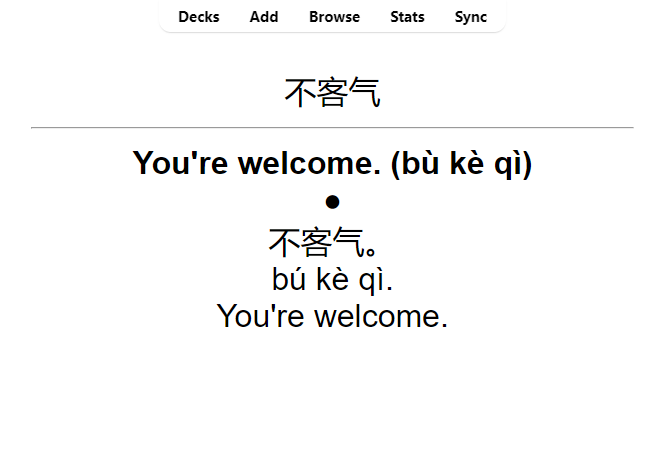
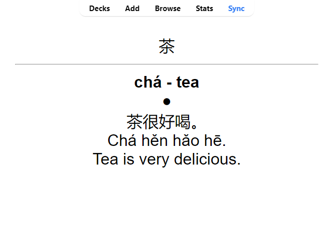

# GenerateAnkiDeck

This repository uses the [OpenAI API](https://openai.com/blog/openai-api) in conjunction with the [genanki](https://github.com/kerrickstaley/genanki) python package for automatically generating anki decks. The initial purpose of the repo was to quickly generate (and re-generate) flash cards for practicing for the Chinese HSK exams, however the general principles and code structure should to more than just language learning. That said, one should be cautious when using this for more complex study tasks, e.g. medical studies, as there is no guarantee that the response returned by ChatGPT is correct. For the code to work, you will need to install the packages in the [requirements.txt](requirements.txt) file and input your own OpenAI API key.

_NOTE:_  To install packages from a requirements file, run `pip install -r requirements.txt`


### Example Deck
For the creation of the HSK 1 deck, created a [custom deck model](Scripts/genanki_model_templates.py) for genanki, where the answer contains both the definition of a word and an examples sentence, separated by a dot. Then I tried to asked chatGPT to create an example sentence with the pinyin and english translation, separating each element by a new line. Below are two examples.

 

The only inputs which were required for this was the [list of HSK1 words](https://raw.githubusercontent.com/lemmih/lesschobo/master/data/HSK_Level_1_(New_HSK).csv), such as 不客气 and 茶, which were pulled from a GitHub repository from [lemmih](https://github.com/lemmih). From the list of words, the back of the flashcards is generated. An example for the full HSK-1 deck can be found [here](Decks/HSK1%20(GPT%20Generated).apkg).


### Changing the code
To alter the code, the main changes which need to be made will be to the prompts passed to the GPT and the word list. 


##### Prompts
For this instance, we will refer to two types of prompts, namely *Context* prompts and *Query* prompts which we will define as follows:

|Prompt    | Definition| Example |
|----------|-----------|---------|
|*Context* | Provides context around the scenario | "You are a teaching helping an english student learn Chinese" |
|*Query*   | The query or question which you want a response to | "Can you give me a short sentence using the word 开心 and explain it to me?" |

In the [deck generation script](Scripts/generate_deck.py), these prompts are passed as strings, where the `.format()` method can be used to pass in the relevant variables to each element of the string. The `{to_translate}` parameter for the sentence query is the word that is being used for the front of the card (不客气 and 茶) in the example deck above.

```python
#-- Translation Parameters --#
#Basic mandatory fields
native_language = "English"                                                               # Language to translate words into
learning_language = "Mandarin Chinese"                                                    # Language to translate the words from

#Additional information or queries
additional_sentence_context = "Try to use simple words in the HSK1 to HSK3 vocabulary lists."
additional_sentence_query = "Include the translated sentence, the pinyin, and english translation, each separated by a new line."


#-- Query Templates --#
#Parameters for the GPT model for creating sentences
gpt_translate_context = 'You are a {learning_language} to {native_language} dictionary, providing concise translations. You only return the translation and pinyin.'
gpt_sentence_context = 'You are a helpful assistant that is helping an {native_language} speaker to learn {learning_language}. {additional_sentence_context}'
gpt_sentence_query = 'Create a short example sentence in {learning_language} that uses "{to_translate}". {additional_sentence_query}'
```

For other languages, it should be sufficient to change the `native_language` and `learning_language` parameters as well as modifing the additional sentence contexts and queries. However, feel free to modify the prompts as required for your desired use-case. Note that changes in the name of variables within the prompt may also need to be changed further down in the script.


##### Word list
The word list is the list of words which you want to pass to the GPT. This will change depending on what you want to generate flashcards for. It could be pre-defined list of words (e.g. HSK vocabulary or 500 most common words in a language), or it could be a custom word list. As long as these words are being passed as a list or an array which can be iterated over this should work.

In this case, we have read in the HSK1 vocabulary, and have a few lines of code to extract the list of words. The list and potential data cleaning will need to be adjusted for your use case.

```python
#-- Word List --#
hsk_level = 1
wordlist_file = f"https://raw.githubusercontent.com/lemmih/lesschobo/master/data/HSK_Level_{hsk_level}_(New_HSK).csv"

#-- Read & Format Word List --#
#Read in word list file
word_df = pd.read_csv(wordlist_file, index_col=0, header=1)

#Data-source specific formatting, in this case, removing any words which do not correspond with the HSK level.
mask = [int(x[0]) == hsk_level for x in word_df["HSK \nLevel-Order"]]
words = word_df.loc[mask, "Word"].values
```

This will result in a numpy array called `words` which contains all the words which you want to create a card of.In this case, the first 5 elements of this array will be `['爱', '八', '爸爸', '杯子', '北京']`. The code will then loop through all these words to generate the translation as well as other information which has been asked for in the query.


### OpenAI API
For this code to work, you need to have your own OpenAI API key, which you need to add to the code. I have kept my API key in a separate python file in the home directory called *OpenAI_API_Key.py*, which has a single variable in it called `api_key`. This variable is a string which contains my own API key, and is not shared in this repository. To get the code to work as-is, you would need to create a new file called *OpenAI_API_Key.py* in the home directory and create the `api_key` variable and insert your own API key. Once this is done, your initial import should work.

```python
#Read API key from file in home directory (needs to be created)
from OpenAI_API_Key import api_key

#Add the API key to your environment
os.environ["OPENAI_API_KEY"] = api_key
```

If you do not wish to create the separate api key, you can paste your API key directly into the code, although this is generally not advised.